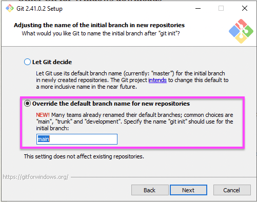

# Connect Workstation to GitHub

## Table of Contents

- [Procedure](#procedure)

## Procedure

1. [Download and install Git](https://git-scm.com/downloads)
   1. It is recommended to override the default branch name for new repositories to "main".
   
   2. All other install sections can be left as default
2. [Download and install GitHub CLI](https://cli.github.com/)
3. Open a CLI
4. Configure username and email.

    ```shell
    git config --global user.name “your username”
    git config -–global user.email “your email”
    ```

5. Verify email and username was configured correctly.

    ```shell
    git config --global user.name
    git config -–global user.email
    ```

6. Authenticate with a GitHub Host

    ```shell
    gh auth login

    # Answer Prompts
    ? What account do you want to log into? GitHub.com
    ? What is your preferred protocol for Git operations? HTTPS
    ? Authenticate Git with your GitHub credentials? Yes
    ? How would you like to authenticate GitHub CLI? Login with a web browser

    ! First copy your one-time code: XXXX-XXXX
    - Press Enter to open github.com in your browser...

    # Answer Web Prompts

    ✓ Authentication complete. Press Enter to continue...

    - gh config set -h github.com git_protocol https
    ✓ Configured git protocol
    ✓ Logged in as your-username
    ```

More information about the setup process can be found [here](https://docs.github.com/en/get-started/quickstart/set-up-git).

Now your workstation is connected to GitHub!

**Next: [Initialize a Local Repository](Initialize%20a%20Local%20Repository.md)**
