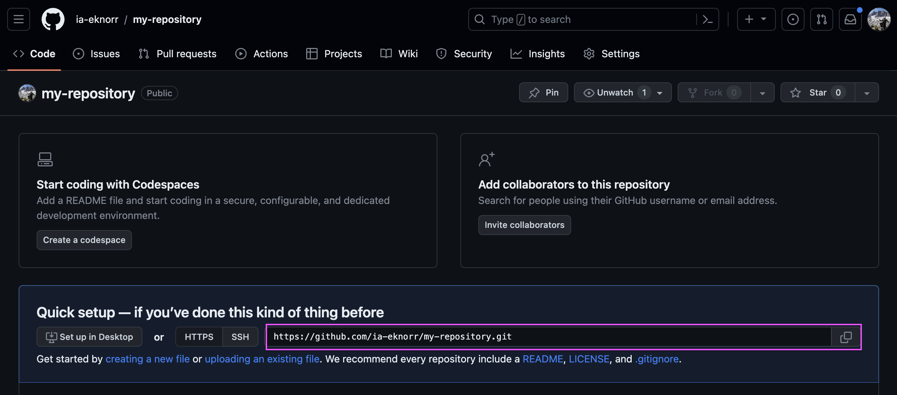

# Initialize a Local Repository
## Table of Contents
- [Procedure](#procedure)

## Procedure
1. In the CLI navigate to file directory for this project. Use `mkdir` to make a new directory if necessary.
    ```shell
    cd /Your/File/Path
    mkdir Repository-Folder
    cd Repository-Folder
    ```
2. Once in the correct folder, initialize the repository with Git.
    ```shell
    git init -b main
    ```
> :memo: **_Note_**: This newly initialized repository has been given a default branch name of `main`. This could be called anything and has traditionally been called `master`, which has fallen out of favor in recent years, many instead opting for names like `main`, `trunk`, or `stable`.

3. Now that the **local** repository is initialized, go to [GitHub](https://github.com) and create the **remote** repository if has not already been created.
   - Check out the GitHub documentation on [Creating a Repo](https://docs.github.com/en/enterprise-server@3.7/get-started/quickstart/create-a-repo).

4. Finally, link workstation to the Remote Repository created. 
   1. Navigate to remote repository webpage
   2. Copy the repository link
       - If the repo was just created, the link should be found near the top of the main page of the repo webpage: 
   3. In the CLI, run the following script to tell the local repository
        ```shell
        git remote add origin <repository-link>
        ```
      > :memo: **_Note_**: The git remote add command takes two arguments: 
      > - A remote name, for example, `origin`
      > - A remote URL, for example, https://inductive-git.ia.local/eknorr/version-control.git
      > 
      > Although any name _could_ be used to reference the remote repository, it is conventional to use  `origin`. The [IA Git Style Guide](https://inductive-git.ia.local/eknorr/git-style-guide.git) should be followed wherever possible.

      > :memo:**_Note_**: A local repository can have multiple remote sources. In the case of a forked repository, an `upstream` remote would conventionally reference the original repository location, while `origin` would reference the copy that was made to push local changes for testing before pushing to the `upstream` repository.

The local repository is now linked with the remote repository and is ready to accept new changes.

**Next: [Create a branch and push changes](Create%20a%20Branch%20and%20Push%20changes.md)**